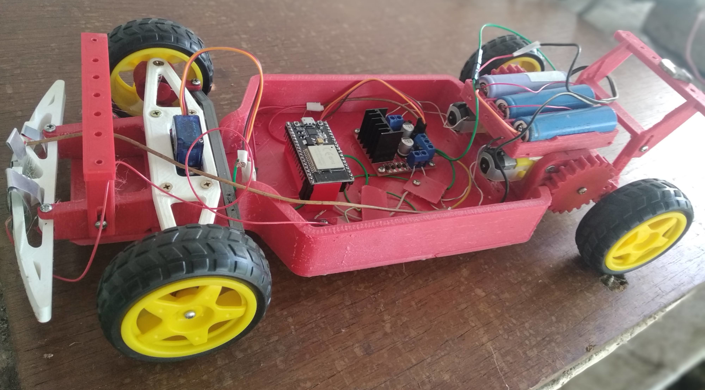
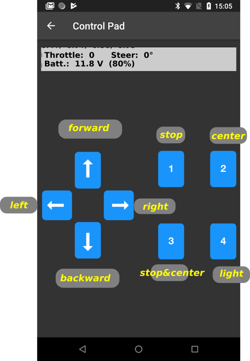

# ESP32 RC Car
Command a low cost Remote Control Car using your cell phone.

The main objective of this project is the construction of a very low cost remote control car, but with high performance.

See the [video](https://vimeo.com/769987253) of the first Test on the field.
## Hardware
* ESP32 board loaded with the Micropython firmware.
* L298N H-Brigge.
* 2 x cheap dc motors.
* SG90 Angular servo.
* 3x 18650 Li-ion batteries.
* Chassis: For my prototype I have used the excellent work of [Antonio Garcia](https://www.thingiverse.com/thing:4892947) with some modifications (mounting of motors and their gears)
* Cell phone with the Bluefruit app.
* optional: 2 white leds, transistor and resistors as shown on the [wiring image](https://github.com/rodo54/Esp32_Car/blob/main/images/Car-Esp32_w.png).
## Software
* The python files included in this repo.
## How to Drive
1. Turn on the power switch. A slight movement in the front wheels is the sign that your car is ready.
2. Open the *Bluefruit* app and select the **Car-ESP32** device.
3. Choose **Controller** and then **Control Pad**

### Using the accelerometer (experimental)
3a. You **must** put your cell phone in **landscape** position!

4a. Choose **Controller** and then **Accelerometer**

(I'm still not satisfied with this mode, try it and send me your feedback)
